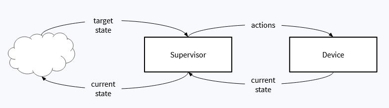
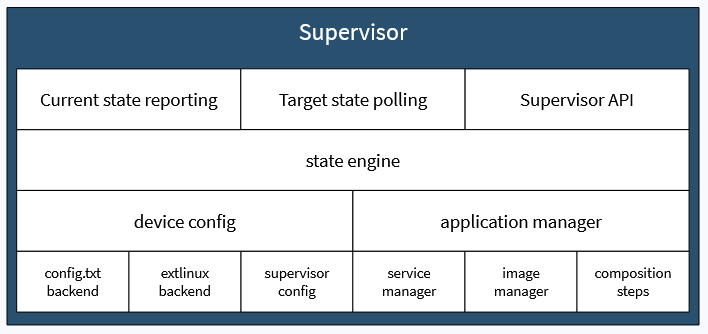
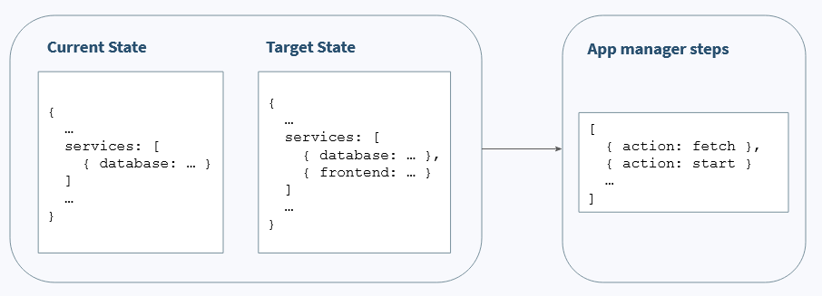
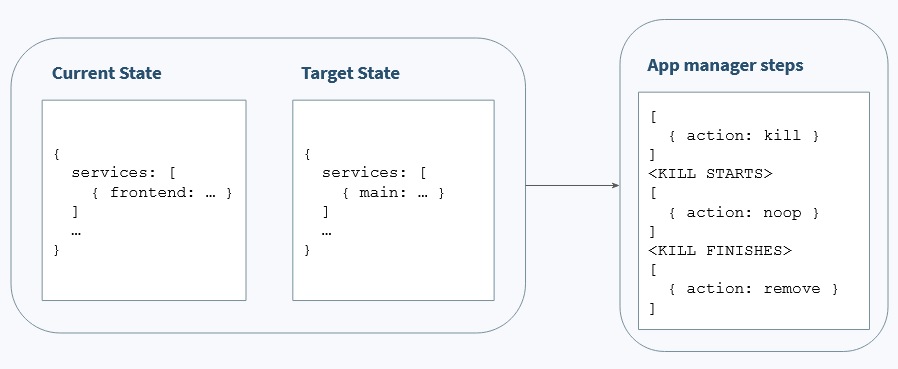
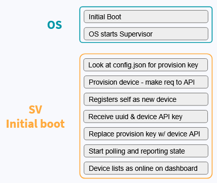
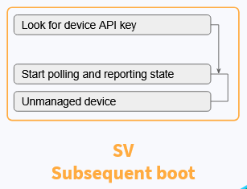

# Supervisor 101

An intro to balena [Supervisor](https://github.com/balena-io/balena-supervisor)'s codebase, dev env, and anything else, without assuming prior knowledge of any aspects of balena.

<br>

## What is the Supervisor?

According to the supervisor repo:

> balenaSupervisor is [balena](https://balena.io/)'s on-device agent, responsible for monitoring and applying changes to an IoT device. It communicates with balenaCloud and handles the lifecycle of an IoT application.
>
> Using the [balenaEngine](https://balena.io/engine)'s (our IoT-centric container engine) remote API, balenaSupervisor will install, start, stop and monitor IoT applications, delivered and ran as [OCI](https://www.opencontainers.org/) compliant containers.

### Containers
What is containerization? [Here](https://www.iteachrecruiters.com/blog/docker-explained-visually-for-non-technical-folks/) is a good nontechnical explanation.

### Location
A diagram of Supervisor's location on the device, as shown in [a balena primer](https://www.balena.io/docs/learn/welcome/primer/#a-balena-primer):

<!--  -->

### Features
1. An intermediary between balena API / the dashboard and the device wth its applications
    - Act on state changes provided by the API
    - Provides feedback to the API about the device state
2. Handles device provisioning
    - On initial boot, makes sure device is registered to balena API correctly
3. Manages app lifecycle & state
    - Gracefully resume from errors, power outages, or network inconsistencies that may occur during an application's lifecycle
    - Execute actions such as restart, fetch, delete images, cleanup, etc. in response to state changes
4. Handles device configuration and power state

### State
What is state, in the context of the Supervisor?

For the Supervisor, there are two types of state: *current state* and *target state*.

A device is a collection of systems (user applications, network / VPN, boot configuration, Linux kernel configuration, etc.). These systems' runtime configurations, at a point in time, comprise the device's *current state*.

Supervisor reports this *current state* to balena API. We'll refer to balena API as "the API" from now on (as opposed to "the Supervisor API", which we'll explain later).

Supervisor gets a desired configuration from the API, which we call *target state*, and performs necessary actions on the device to make current state conform to target state.



<br>

## How does the Supervisor work?

### Architecture



The above diagram shows the internal architecture of the Supervisor. Communication happens between layers, with the topmost layer being the Supervisor's interfaces.

- Current state reporting
    - OUTwards communication of device's current state to the cloud at certain intervals
- Target state polling
    - INwards reception of target state from the API
    - Happens at certain user-configurable intervals or on certain events such as a dashboard action
- Supervisor API
    - Interface for other balena.io products
- State engine
  - Attempts to bring *current state* in line with *target state*
  - Analyzes differences between current state and target state, relegating actions a layer down to device config or applications manager.
  - Responsible for graceful resumability from interrupts
- Application manager
  - Generates and executes Docker-related steps (composition steps) for how the current state of an application can reach the target state
  - Example steps: fetch (fetch image / delta), kill (kill running container), removeImage, createVolume
- Device config
  - In response to relevant changes in target state, changes various configurations on the device
  - Does NOT generate different steps like the application manager. Any configuration changes happen within one composition step, changeConfig
  - Examples of configuration changes: VPN mode, deltas, splash screen, persistent logging

### State reporting / polling - the state endpoint
The Supervisor reports and receives state from a balena API endpoint, which is the source of truth for device state. Here is the cycle that occurs:

1. Supervisor polls sum of changes from balena API as *target state*.
2. Some actions result in device state change on balenaCloud, which is then reported in the API:
    - Release changes (User pushes a new release)
    - Dashboard config changes (Many device configs listed in the previous section are controllable through the dashboard)
3. Supervisor calculates the best way to bridge the gap between *current state* and *target state*, and then performs those actions.
4. Supervisor reports device's *current state* at regular intervals.

### State engine funnel
The Supervisor's state "engine" runs in a loop, applying target state in steps until no more steps are present, looping as necessary:

1. Apply device configuration changes
    - All the backends (`config.txt`, `extlinux`, etc.) are asked if the device is supported
    - Each backend validates target state and normalizes values
2. Apply application changes
    - Performs a diff calculation on the balenaEngine resources (containers/images/volumes/networks)
3. Exit out of funnel loop once no more changes are needed

Some generated composition steps, such as killing a service or downloading an image, are performed asynchronously, because the Supervisor utilizes a noop (no-operation) step to delay future steps when an IO operation is needed. Therefore, the Supervisor will produce a list of steps to perform now, then it will recalculate steps on the next loop, after the current list of steps have been executed.

### Examples
Deploying a new frontend service:


Waiting for generated steps to complete:


The noop action is added after the kill action because the Supervisor needs to wait for the frontend service to be killed before removing it. Later on, a fetch step and a start step (not pictured) will be generated. This noop action does nothing, but will cause the steps to be recalculated after the kill action finishes.

<br>

# FAQs

## What's the main tech/language/library stack for Supervisor?

Languages:

- TypeScript

Frameworks/Libraries:

- Node + Express
- Dockerode
- Mocha/Chai/Sinon

<br>

## What is the typical lifecycle of an IoT application in balenaCloud?

(First boot)

1. Initial noot
2. OS starts Supervisor
3. Supervisor looks at `config.json` file for provisioning key 
4. Provision device with key by making a request to balena API
5. Device is registered as new in balenaCloud backend through API
6. Device receives UUID and device API key
7. Supervisor replaces provisioning key with device API key
8. Supervisor starts polling and reporting state
9. Device displays as online in dashboard

(Subsequent boot)
1. Boot
2. OS starts Supervisor
3. Supervisor looks for device API key
    - If key: Supervisor starts polling and reporting state
    - If no key: Device is unmanaged, and not handled by balenaCloud platform

(Application registry updated)

1. Triggers delta download with one of several selectable update strategies
2. Update application using supplied delta, taking advantage of delta-friendly balenaEngine

 

<br>

## How to make Supervisor developers' lives easier when debugging Supervisor issues?
1. Are you running the latest Supervisor version? Issues are more likely to be fixed in a later version than an earlier one.

2. Attempt to figure out how to reproduce the issue. This includes asking for device type, versions, and user configurations, as well as asking the user exactly what steps they took to encounter the issue. Then, if possible, if you know how, and if it doesn't take too long, verify that you can reproduce the issue. See the related [masterclass section](https://www.balena.io/docs/learn/more/masterclasses/device-debugging/#8-working-with-the-supervisor) for various tips.

3. If you can't reproduce the issue, ask for as many logs as possible.

## How does the supervisor talk to the engine? Why do I see 404 errors?
Supervisor talks to balenaEngine through HTTP. balenaEngine exposes an HTTP API for communication, much like Docker engine does.

You might see a 404 error because an error happens in balenaEngine, such as:
- Race condition. For example, an image is manually deleted while it's being downloaded.
- While building, intermediate images are deleted.

The above can be summarized as: when balenaEngine expects a resource and it's not there, a 404 error will occur.

<br>

## How are Supervisor versions released?
You might have noticed that the latest Supervisor version available on the dashboard doesn't correspond to the latest version listed on the Supervisor GitHub repo. Currently, this is because Supervisor devs do manual releases. When we want to bump the Supervisor version on new OS releasees, we must make a PR in the meta-balena repo. When we want to provide a new version to a user as a self-serve update, Miguel (@20k-ultra) has a script to make that happen.

This is obviously less than ideal. In the future, the CI/CD pipeline should automatically make the latest version on GitHub available on the cloud and to new OS releases.

<br>

## Can you downgrade the Supervisor?
No.

<br>

## How does Supervisor local mode work?

In normal mode, a device's source of truth for target state is balena API. When local mode is enabled, the device no longer communicates with balena API for its target/current state. Instead, the user may query current state through a Supervisor API endpoint, and set target state using another Supervisor API endpoint. All other internal functions of the Supervisor remain the same.

<br>

## What are update locks for?
A configurable setting which, if locks are on, stops applications on the device from updating when balenaCloud's device state (target state) changes. This is important for mission-critical devices that can't ever go offline or risk erroring, such as flying drones. Even with update locks set, the user may allow "lock overrides" on the dashboard, which enables specific commands to override these update locks. This is a risky operation but may result in an application or the device exiting out of an invalid state.

<br>

## What's the current state of dependent device support on the Supervisor?
Dependent devices refer to devices that cannot run balenaOS for one reason or another, invalid chipsets or lack of network access being among them. Dependent applications refer to applications that are supervised by the Supervisor, but are designed to run on dependent devices. Applications may be given control over the state of dependent applications. Examples of dependent devices include microcontrollers, such as Arduinos.

Currently, there is a file in Supervisor named `proxyvisor.js` which provides an HTTP API for interacting with dependent devices and dependent applications. However, it's not a public feature yet, so there are a few things that don't work completely.

<br>

## What are deltas?

Read [here](https://www.balena.io/docs/learn/deploy/delta/) to learn more about deltas.

<br>

## What are contracts?

[@balena/contrato](https://github.com/balena-io/contrato) is the official contracts implementation. 
- [Documentation](https://balena-io.github.io/contrato/index.html)
- [Vision Week 2021 - Contracts deep dive](https://drive.google.com/drive/folders/1yqAceE7yC7P4wnarfegaXC--P4xWzRxo)

<br>

## How do application updates occur?

https://www.balena.io/docs/learn/welcome/primer/#getting-to-the-devices

How are env vars set? (Dashboard, within application Dockerfile, what else?) What dictates a reboot when setting an env var?

https://github.com/balena-io/balena-supervisor/blob/master/docs/update-locking.md

<br>

## How is the Supervisor API versioned?

v1 - single container

v2 - multi-container

v3 - planned multi-app (planned for mid/late 2021)

<br>

## Why must a VPN be used to communicate directly with the device?

Encrypted communication between balenaCloud and device (either VPN or HTTPS).

<br>

## How does Supervisor pass command args to the underlying kernel? Example?

<br>

## What is the preferred dev env for Supervisor?

Livepush is sufficient for most use cases. To replace the Supervisor running on your device with your current Supervisor code, run `npm run sync -- <YOUR_DEVICE_LOCAL_IP>`. Optionally, you may need to specify your device architecture with the `-a <ARCH>` flag. After you stop your livepush instance, the original Supervisor should take over. (You may need to remove your livepush instance.)

<br>

## What data is being stored in the SQLite3 database?

When SSH-ing into the host OS terminal or accessing it from the dashboard, you may inspect the contents of the Supervisor database by running the following commands:

1. `balena exec -it resin_supervisor node`
2. `sqlite3 = require('sqlite3');`
3. `db = new sqlite3.Database('/data/database.sqlite');`

From here, you may execute SQL queries to see the contents of various tables. To see a list of all tables, run `db.all("SELECT name FROM sqlite_master WHERE type='table' ORDER BY name;", console.log);`.

<br>

## What are the various ways to set host configs in Supervisor?

- `GET /v1/device/host-config` (for hostname, redsocks proxy configuration)
- By changing env vars on the dashboard

<br>

## What are the challenges that stand in the way of creating v3 endpoints?

<br>

# Tips

- Use [nvm](https://github.com/nvm-sh/nvm) to avoid any node version conflicts
- Install with `npm ci` instead of `npm install`
- If using VSCode and Prettier, add `.prettierrc` in your home directory with the following:
  ```json
  {
  	"singleQuote": true,
  	"trailingComma": "all",
  	"useTabs": true
  }
  ```
- There is a [section](https://www.balena.io/docs/learn/more/masterclasses/device-debugging/#8-working-with-the-supervisor) in the device debugging masterclass which gives some tips about the Supervisor.
